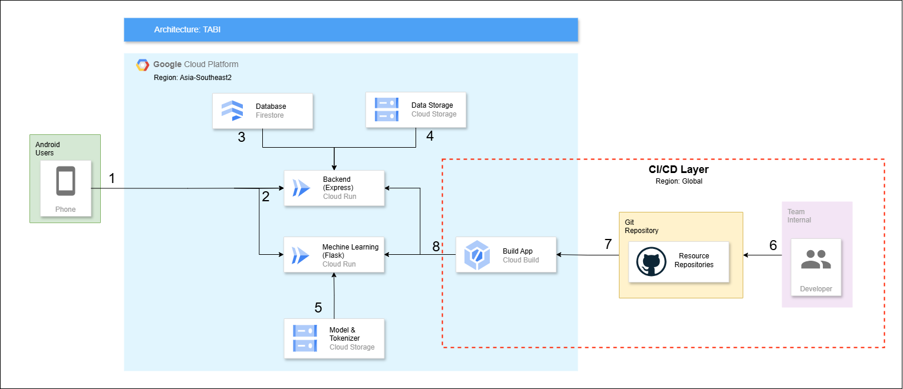

### Architecture Cloud


---
### Structure Folder
```
CloudComputing/
├── app/
│   ├── controllers/
│   │   ├── regionController.js
│   ├── routes/
│   │   ├── regionRoutes.js
│   ├── services/
│   │   ├── regionService.js
│   ├── utils/
│   │   ├── data.js
│   ├── app.js
├── server.js
├── Dockerfile
├── cloudbuild.yaml
├── .gitignore
```
---
### API Specification for TabiApp

**Base URL:**  
`https://tabiapp-65059410484.asia-southeast2.run.app/api`


### Endpoints

#### 1. **Get All Regions**  
**GET** `/regions`  

**Description:**  
Returns a list of all regions.

**Response:**
- **200 OK**  
  ```json
  {
    "success": true,
    "message": [/* Array of regions */]
  }
  ```
- **500 Internal Server Error**  
  ```json
  {
    "success": false,
    "message": "Failed to fetch regions.",
    "error": "Error details (if any)"
  }
  ```

---

#### 2. **Get Region Details**  
**GET** `/regions/:regionName`  

**Description:**  
Returns detailed information about a specific region.

**Path Parameters:**
- `regionName` *(string)*: Name of the region.

**Response:**
- **200 OK**  
  ```json
  {
    "success": true,
    "message": {/* Region details */}
  }
  ```
- **404 Not Found**  
  ```json
  {
    "success": false,
    "message": "Region '<regionName>' not found."
  }
  ```
- **500 Internal Server Error**  
  ```json
  {
    "success": false,
    "message": "Failed to fetch region detail.",
    "error": "Error details (if any)"
  }
  ```

---

#### 3. **Get Region Manners**  
**GET** `/regions/:regionName/manners`  

**Description:**  
Fetches manners or traditions related to the specified region.

**Path Parameters:**
- `regionName` *(string)*: Name of the region.

**Response:**
- **200 OK**  
  ```json
  {
    "success": true,
    "message": [/* Array of manners */]
  }
  ```
- **404 Not Found**  
  ```json
  {
    "success": false,
    "message": "Region '<regionName>' not found."
  }
  ```
- **500 Internal Server Error**  
  ```json
  {
    "success": false,
    "message": "Failed to fetch manners.",
    "error": "Error details (if any)"
  }
  ```

---

#### 4. **Get Region Places**  
**GET** `/regions/:regionName/places`  

**Description:**  
Fetches notable places from the specified region.

**Path Parameters:**
- `regionName` *(string)*: Name of the region.

**Response:**
- **200 OK**  
  ```json
  {
    "success": true,
    "message": [/* Array of places */]
  }
  ```
- **404 Not Found**  
  ```json
  {
    "success": false,
    "message": "Region '<regionName>' not found."
  }
  ```
- **500 Internal Server Error**  
  ```json
  {
    "success": false,
    "message": "Failed to fetch places.",
    "error": "Error details (if any)"
  }
  ```

---

#### 5. **Get Region Foods**  
**GET** `/regions/:regionName/foods`  

**Description:**  
Fetches popular foods from the specified region.

**Path Parameters:**
- `regionName` *(string)*: Name of the region.

**Response:**
- **200 OK**  
  ```json
  {
    "success": true,
    "message": [/* Array of foods */]
  }
  ```
- **404 Not Found**  
  ```json
  {
    "success": false,
    "message": "Region '<regionName>' not found."
  }
  ```
- **500 Internal Server Error**  
  ```json
  {
    "success": false,
    "message": "Failed to fetch foods.",
    "error": "Error details (if any)"
  }
  ```

---

### Example Usage

#### Fetch All Regions
```bash
GET https://tabiapp-65059410484.asia-southeast2.run.app/api/regions
```

#### Fetch Details of a Region
```bash
GET https://tabiapp-65059410484.asia-southeast2.run.app/api/regions/Yogyakarta
```

#### Fetch Manners of a Region
```bash
GET https://tabiapp-65059410484.asia-southeast2.run.app/api/regions/Bali/manners
```

#### Fetch Places of a Region
```bash
GET https://tabiapp-65059410484.asia-southeast2.run.app/api/regions/Semarang/places
```

#### Fetch Foods of a Region
```bash
GET https://tabiapp-65059410484.asia-southeast2.run.app/api/regions/Jakarta/foods
```

---
